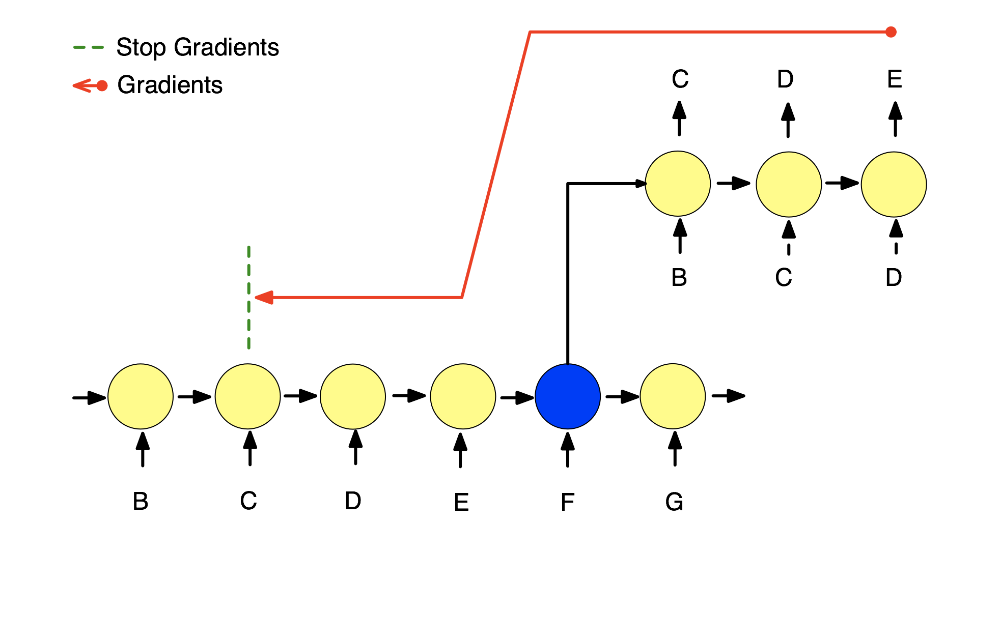

# RESUMEN PAPERS

## Nuevas arquitecturas para el procesamiento de datos Secuenciales

#### Learning Longer-term Dependencies in RNNs with Auxiliary Losses [arxiv:1803.00144](https://arxiv.org/abs/1803.00144)

En este paper se propone el uso de perdidas auxiliares no supervisadas, en contraposición a la perdida principal, que permita reconstruir/predecir un segmento aleatorio de la secuencia antes o después de un punto de anclaje, esto permite hacer truncate backpropagation (TTBP) unos pocos pasos desde la pérdida supervisada (perdida principal) lo cual disminuye los costos de las redes recurrentes sin pérdida en las dependencias de largo alcance. Un esquema principal de este paper se muestra en la siguiente figura.

 

Se proponen dos tipos de perdidas auxiliares, la reconstrucción y la predicción.

1) La perdida auxiliar mediante reconstruccion consiste en intentar reconstruir una subsecuencia anterior al punto de anclaje mediante un modelo de encoder-decoder regresivo, a este modelo se le llama rLSTM. Esto se puede apreciar en la siguiente figura.

 

2) La perdida auxiliar de predicción consiste en predecir los siguientes pasos de la secuencia posteriores a un punto de anclaje, a este modelo se le llama pLSTM. Esto se puede apreciar en la siguiente figura.

 

Los modelos se sometieron a pruebas de estrés de memoria y a tareas de lenguaje comparando la performance con LSTM full BP, con LSTM Truncate BP (truncando en 300 steps) y Transformer.

Los resultados muestran que en ciertos dataset presenta mejoras sustanciales, mientras que en otros se si bien no mejora, el costo computacional del entrenamiento es considerablemente menor.

Tabla 1: Test accuracy (%)

|                   | MNIST   | pMNIST  | CIFAR10 |
|-------------------|---------|---------|---------|
| LSTM Full BP      | 98.3    | 89.4    | 58.8    |
| LSTM Truncate300  | 11.3    | 88.8    | 49.0    |
| Transformer       |**98.9** |**97.9**| 62.2    |
| rLSTM Truncate300 | 96.4    | 92.8    | 65.9    |
| pLSTM Truncate300 | 95.4    | 92.5    | 64.7    |
| rLSTM Full BP     | 98.4    | 95.2    |**72.2** |
| pLSTM Full BP     | 98.0    | 92.8    | 67.6    |

#### Nested LSTMs [arxiv:1801.10308](https://arxiv.org/abs/1801.10308)

En este paper se propone una nueva arquitectura de red recurrente inspirada en la LSTM pero que presentaría mejores dependencias temporales de largo alcance comparada con el apilamiento de LSTM clásicas.

Para ello lo que se propone es la concatenación de la celda de memoria ($c_{t}^{outer}$) en lugar de la suma como se realiza en la LSTM clásica, con ello la funcion de estado queda:

\begin{aligned}
c_t &= m_t\, (f_t\odot c_{t-1} , i_t \odot g_t) = m_t \,(\tilde{h_{t-1}}, \tilde{x_t})\\
\tilde{h_{t-1}} &= f_t\odot c_{t-1}\\
\tilde{x_t} &= i_t \odot \sigma_c\left(x_t\, W_{xc} + h_{t-1}\, W_{hc} + b_c\right)
\end{aligned}

En particular si la funcion de memoria ($m$) es la suma se puede reconstruir la LSTM clásica. Ambas celdas se pueden visualizar en la siguiente figura.

#### WaveNet: A Generative Model for Raw Audio [arxiv:1609.03499](https://arxiv.org/abs/1609.03499)

En este paper se propone una nueva arquitectura para la generacion de audio bruto. La arquitectura es un modelo generativo autoregresivo capaz de utilizar toda la historia para la predicción del siguiente step, para ello utiliza celdas convolucionales con dilation y una última capa softmax para determinar la distribución de probabilidades.

Esta arquitectura respeta el orden de la secuencia pese a utilizar cnn, esto asegura ser mas rápido que las arquitecturas recurrentes clásicas.

Además se apilan dilated convolucionales siguiendo una serie del tipo ($2^l$) con $l$ el indice de la capa oculta respectiva, esto se puede apreciar en la siguiente imagen.

Los resultados de este paper son subjetivos, ya que no evaluan performance sino que la capacidad de un humano de encontrar que el sonido generado era "natural" ya sea en música o en diálogos humanos, presentando preferencia en los idiomas estudiados (chino e inglés).

#### An Empirical Evaluation of Generic Convolutional and Recurrent Networks for Sequence Modelling [arxiv:1803.01271](https://arxiv.org/abs/1803.01271)

#### Trellis Networks for Sequence Modeling [arxiv:1810.06682](https://arxiv.org/abs/1810.06682)

## Nuevas arquitecturas para Reinforcement Learning

#### Configurable Markov Processes [arxiv:1806.05415](https://arxiv.org/abs/1806.05415)

#### On improving Deep Reinforcement Learning for POMDPs [arxiv:1704.07978](https://arxiv.org/abs/1704.07978)

#### Deep Variational Reinforcement Learning for POMDPs [arxiv:1806.02426](https://arxiv.org/abs/1806.02426)

