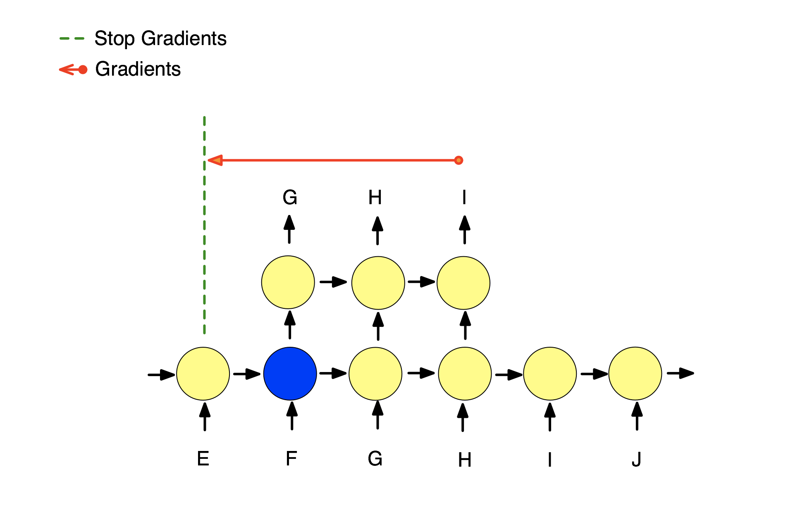

# RESUMEN PAPERS

## Nuevas arquitecturas para el procesamiento de datos Secuenciales

#### Learning Longer-term Dependencies in RNNs with Auxiliary Losses [arxiv:1803.00144](https://arxiv.org/abs/1803.00144)

En este paper se propone el uso de perdidas auxiliares no supervisadas, en contraposición a la perdida principal, que permita reconstruir/predecir un segmento aleatorio de la secuencia antes o después de un punto de anclaje, esto permite hacer truncate backpropagation (TTBP) unos pocos pasos desde la pérdida supervisada (perdida principal) lo cual disminuye los costos de las redes recurrentes sin pérdida en las dependencias de largo alcance. Un esquema principal de este paper se muestra en la siguiente figura.

 

Se proponen dos tipos de perdidas auxiliares, la reconstrucción y la predicción.

1) La perdida auxiliar mediante reconstruccion consiste en intentar reconstruir una subsecuencia anterior al punto de anclaje mediante un modelo de encoder-decoder regresivo, a este modelo se le llama rLSTM. Esto se puede apreciar en la siguiente figura.

 

2) La perdida auxiliar de predicción consiste en predecir los siguientes pasos de la secuencia posteriores a un punto de anclaje, a este modelo se le llama pLSTM. Esto se puede apreciar en la siguiente figura.

 

Los modelos se sometieron a pruebas de estrés de memoria y a tareas de lenguaje comparando la performance con LSTM full BP, con LSTM Truncate BP (truncando en 300 steps) y Transformer.

Los resultados muestran que en ciertos dataset presenta mejoras sustanciales, mientras que en otros se si bien no mejora, el costo computacional del entrenamiento es considerablemente menor.

Tabla 1: Test accuracy (%)

|                   | MNIST   | pMNIST  | CIFAR10 |
|-------------------|---------|---------|---------|
| LSTM Full BP      | 98.3    | 89.4    | 58.8    |
| LSTM Truncate300  | 11.3    | 88.8    | 49.0    |
| Transformer       |**98.9** |**97.9**| 62.2    |
| rLSTM Truncate300 | 96.4    | 92.8    | 65.9    |
| pLSTM Truncate300 | 95.4    | 92.5    | 64.7    |
| rLSTM Full BP     | 98.4    | 95.2    |**72.2** |
| pLSTM Full BP     | 98.0    | 92.8    | 67.6    |

#### Nested LSTMs [arxiv:1801.10308](https://arxiv.org/abs/1801.10308)

En este paper se propone una nueva arquitectura de red recurrente inspirada en la LSTM pero que presentaría mejores dependencias temporales de largo alcance comparada con el apilamiento de LSTM clásicas.

Para ello lo que se propone es la concatenación de la celda de memoria ($c_{t}^{outer}$) en lugar de la suma como se realiza en la LSTM clásica, con ello la funcion de estado queda:

\begin{aligned}
c_t &= m_t\, (f_t\odot c_{t-1} , i_t \odot g_t) = m_t \,(\tilde{h_{t-1}}, \tilde{x_t})\\
\tilde{h_{t-1}} &= f_t\odot c_{t-1}\\
\tilde{x_t} &= i_t \odot \sigma_c\left(x_t\, W_{xc} + h_{t-1}\, W_{hc} + b_c\right)
\end{aligned}

En particular si la funcion de memoria ($m$) es la suma se puede reconstruir la LSTM clásica. Ambas celdas se pueden visualizar en la siguiente figura.

#### WaveNet: A Generative Model for Raw Audio [arxiv:1609.03499](https://arxiv.org/abs/1609.03499)

En este paper se propone una nueva arquitectura para la generacion de audio bruto. La arquitectura es un modelo generativo autoregresivo capaz de utilizar toda la historia para la predicción del siguiente step, para ello utiliza celdas convolucionales con dilation y una última capa softmax para determinar la distribución de probabilidades.

Esta arquitectura respeta el orden de la secuencia pese a utilizar cnn, esto asegura ser mas rápido que las arquitecturas recurrentes clásicas.

Además se apilan dilated convolucionales siguiendo una serie del tipo ($2^l$) con $l$ el indice de la capa oculta respectiva, esto se puede apreciar en la siguiente imagen.

Los resultados de este paper son subjetivos, ya que no evaluan performance sino que la capacidad de un humano de encontrar que el sonido generado era "natural" ya sea en música o en diálogos humanos, presentando preferencia en los idiomas estudiados (chino e inglés).

#### An Empirical Evaluation of Generic Convolutional and Recurrent Networks for Sequence Modelling [arxiv:1803.01271](https://arxiv.org/abs/1803.01271)

En este paper se propone una nueva arquitectura llamada Temporal Convolutional Networks (TCN) que presenta performance similar o mejor a redes recurrentes pero con un entrenamiento mucho más rápido ya que se basa en arquitecturas convolucionales las que pueden procesarse en paralelo.

Para ello se utiliza una combinación de redes convolucionales profundas (con augmented y capas residuales) y dilated convolucionales.

Para modelar secuencias temporales solo utiliza la "historia" no utiliza ningun input futuro, esto abarca muchas de las metodologias usadas en predicciones autoregresivas, pero esto deja afuera modelos como los utilizados en machine-translation o seq2seq.

La red genera una secuencia del mismo tamaño que el input por lo que se agrega zero padding de largo (kernel - 1) para mantener las capas posteriores de la misma longitud que las anteriores.

Las TCN utilizan causal convolutions, TCN = 1D FCN + causal convolutions.

Se necesitan redes muy profundas con filtros muy grandes para poder tener un tamaño de memoria grande.

Los resultados muestran que en ciertos dataset presenta mejoras sustanciales en comparación con las arquitecturas recurrentes clásicas.

Tabla 1: Test accuracy (%)

|            | MNIST   | pMNIST  |
|------------|---------|---------|
| LSTM       | 87.2    | 85.7    |
| GRU        | 96.2    | 87.3    |
| RNN        | 21.5    | 25.3    |
| TCN        | 99.0    | 97.2    |

#### Trellis Networks for Sequence Modeling [arxiv:1810.06682](https://arxiv.org/abs/1810.06682)

En este paper se propone una nueva arquitectura basada en las TCN y que utiliza celdas recurrentes en particular LSTM. Esta arquitectura se diferencia de las TCN en que 1) los pesos están vinculados a través de capas y 2) que el input se introduce en todas las capas.

Una imagen de la TrellisNet a nivel atómico se puede ver en la siguiente imagen, en ella se ve como el input se introduce en cada capa. Sin embargo, una TrellisNet completa se puede construir uniendo estos elementos a través del tiempo y la profundidad. Dado un input se aplica el mismo procedimiento tanto en profundidad como en el tiempo, usando los mismos pesos ( TODO: necesito comprobar que entiendo bien esto)

En el paper se demuestra que cualquier RNN truncada puede ser representada por una TrellisNet, con esto se demuestra que la expresividad teórica de una TrellisNet es al menos la de una RNN truncada.

Si bien pueden utilizar cualquier activación no lineal, se decide usar una activación inspirada en las redes recurrentes y en particular en la LSTM.

Los resultados muestran que en esta arquitectura supera al estado del arte en varios dataset.

|             | MNIST   | pMNIST  | CIFAR10 |
|-------------|---------|---------|---------|
| TCN         | 99.0    | 97.2    |  -      |
| r-LSTM      | 98.4    | 95.2    | 72.2    |
| Transformer | 98.9    | 97.9    | 62.2    |
| TrellisNet  | 99.2    | 98.1    | 73.4    |

## Nuevas arquitecturas para Reinforcement Learning

#### On improving Deep Reinforcement Learning for POMDPs [arxiv:1704.07978](https://arxiv.org/abs/1704.07978)

En este paper se estudia una nueva arquitectura de Reinforcement Learning (RL) para la toma de desicion sobre datos parcialmente observados (Partial Observable Markov Decision Process POMDP). Para ello la acción/observación de la serie de tiempo pasan por una capa LSTM que aprende estados latentes en base a los cuales una capa completamente conectada (fully connected) calcula Q-values como en las Deep Q-Networks (DQNs) convencionales. En la siguiente figura se muestra una representación de esta arquitectura.

La accion del estado anterior es incorporada como un input para la siguiente toma de decision, ademas de utilizar el estado previo de la LSTM donde se conserva la información por medio del espacio latente.

Para poder comparar esta arquitectura con otras, se utilzaron data set completamente observados en los cuales con una probabilidad 0.5 se decide si se observa o no el evento en cada tiempo. 

Los resultados muestran que se comporta mejor durante el aprendizaje, obteniendo mejores puntajes incluso cuando los eventos son completamente observados.

#### Deep Variational Reinforcement Learning for POMDPs [arxiv:1806.02426](https://arxiv.org/abs/1806.02426)

En este paper se propone un modelo de Deep Variational Reinforcement Learning (DVRL) el cual introduce un bias inductivo que permite al agente aprender a generar modelos de el ambiente y realizar inferencias en ese modelo para agregar efectivamente la información disponible. 

Para el reinforcement learning se utiliza A2C, una simplificacion sincrona del asincrono A3C. Además, dado que el A3C intercala trayectorias desenrrolladas y realiza una actualización de parámetros solo cada n-steps, hace posible mantener un estado latente aproximadamente correcto.

Los resultados muestran que con esta arquitectura se obtienen mejores resultados para algunos dataset, mientras que para otros la red recurrente convencional es mejor.